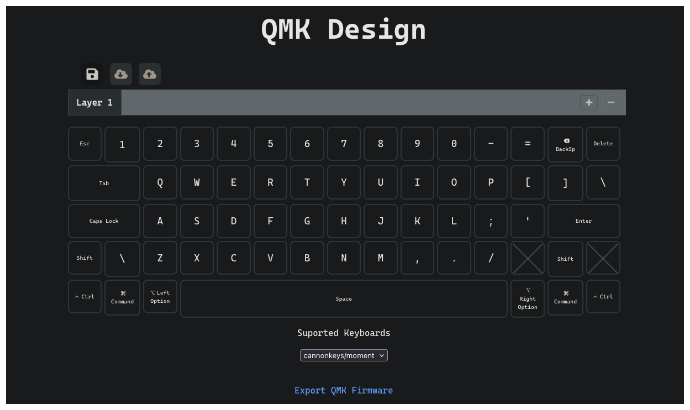

# QMK Design

Charlie Lees

QMK Design is a web app to design QMK firmware for a keyboard using a GUI rather than using the QMK CLI\
Both the front and back-end servers are linked within this repository as sub-modules.

<ins>Frontend</ins>
* Built in TypeScript using React and Vite.
* Hosted on AWS using S3 and CloudFront

<ins>Backend</ins>
* Built in Python with Flask
* Hosted on AWS with Fargate

All references used are included in the README of each respective sub-module
